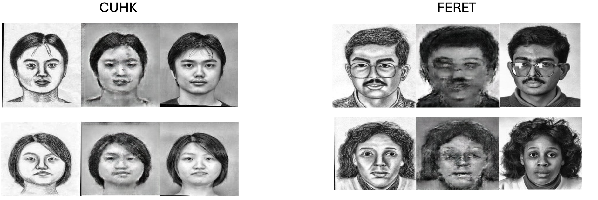

# Facial Sketch to Facial Image Generation using pix2pix

## Overview
This project was implemented as part of my coursework for **EN.553.602 Research and Design in Applied Mathematics: Data Mining**. The goal was to develop a model capable of generating realistic facial images from facial sketches, regardless of race or gender. To achieve this, I leveraged the **pix2pix** model — a paired image-to-image translation approach — using a custom dataset created from images sourced from the **FERET** and **CUSF** datasets.

This project implements a modified version of **paired image-to-image translation pipeline** using the `pix2pix` model from the [pytorch-CycleGAN-and-pix2pix](https://github.com/junyanz/pytorch-CycleGAN-and-pix2pix) repository.

## Dataset
- The custom dataset is a mix of images from the **FERET** and **CUSF** datasets
- Images were cropped and resized uniformly to maintain consistency
- The code used for pre-processing is available for reference
- The preprocessed dataset is available for direct use
- Original training parameters provided in the dataset were modified to suit this project’s needs

## Model Training and Results
- The pix2pix model was trained using paired images (sketch and corresponding face image)
- Training progress and results were saved and tracked using **Weights & Biases**
- The model aims to generate high-quality, realistic facial images from sketches

## Evaluation Metrics
To quantitatively assess the quality of the generated facial images, the following metrics were used:

### Peak Signal-to-Noise Ratio (PSNR)
- PSNR measures the ratio between the maximum possible signal power (original image) and the power of corrupting noise (difference between generated and original images)
- Calculated using the Mean Squared Error (MSE) between the images
- Higher PSNR values indicate better image fidelity (less difference/noise), typically above 30 dB for good quality
- PSNR is a standard metric in image processing but mainly captures pixel-wise similarity, not perceptual quality

### Structural Similarity Index Measure (SSIM)
- SSIM assesses perceptual similarity by evaluating changes in structural information, luminance, and contrast between images
- Values range from -1 to 1, with 1 indicating perfect structural similarity
- SSIM correlates better with human visual perception, making it especially useful for evaluating facial image realism
- It captures structural details like edges and textures that are critical for face image quality

## Running the Code
Please **follow the directions provided in the accompanying Colab notebook** to:
- Set up the environment
- Preprocess the dataset
- Train the pix2pix model
- Generate results
- Compute PSNR and SSIM metrics for evaluation

---

## Sample Results

### Generated Face from Sketch


---

## Citations
If you use this work, please also cite the original authors of the pix2pix framework, whose code and models this project builds upon:
```
@inproceedings{isola2017image,
  title={Image-to-Image Translation with Conditional Adversarial Networks},
  author={Isola, Phillip and Zhu, Jun-Yan and Zhou, Tinghui and Efros, Alexei A},
  booktitle={Proceedings of the IEEE conference on computer vision and pattern recognition (CVPR)},
  year={2017},
  pages={1125--1134}
}

@inproceedings{CycleGAN2017,
  title={Unpaired Image-to-Image Translation using Cycle-Consistent Adversarial Networks},
  author={Zhu, Jun-Yan and Park, Taesung and Isola, Phillip and Efros, Alexei A},
  booktitle={Proceedings of the IEEE international conference on computer vision (ICCV)},
  year={2017},
  pages={2223--2232}
}
```


Special thanks to Jun-Yan Zhu, Taesung Park, Phillip Isola, and Alexei Efros for providing the original pytorch-CycleGAN-and-pix2pix implementation which served as the backbone for this work.

